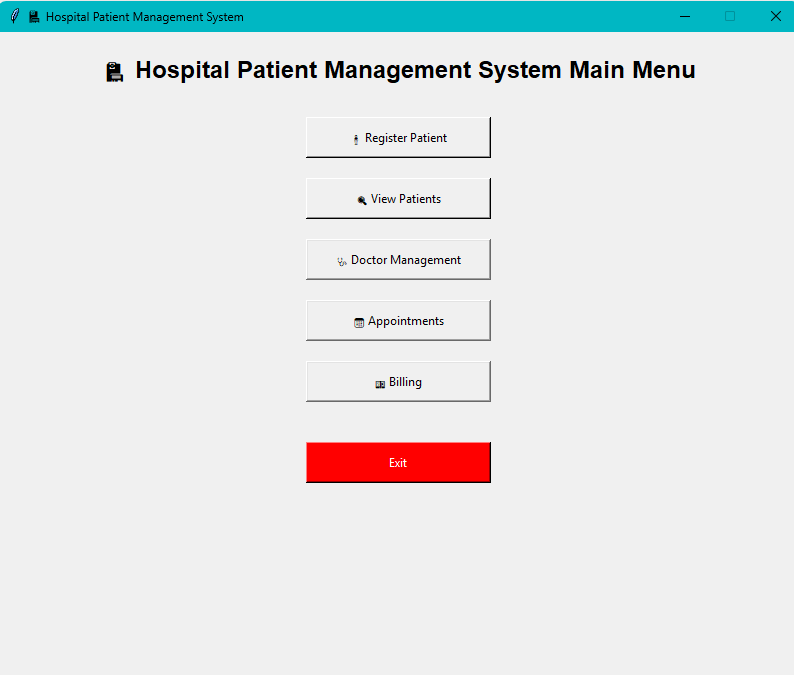
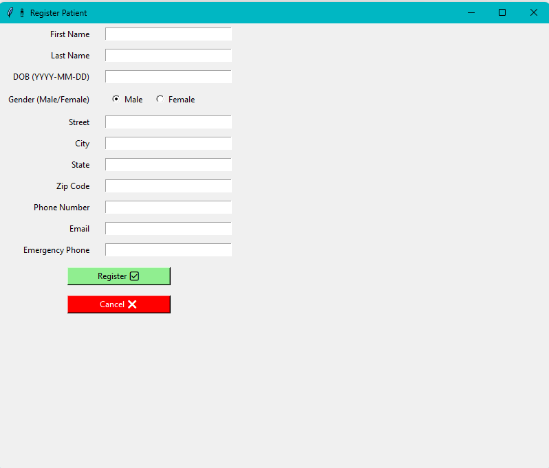
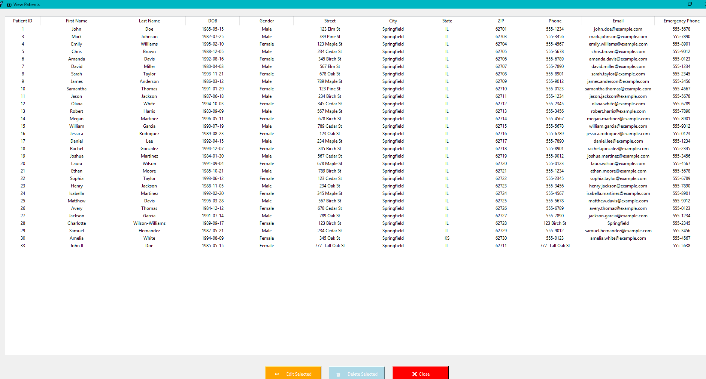
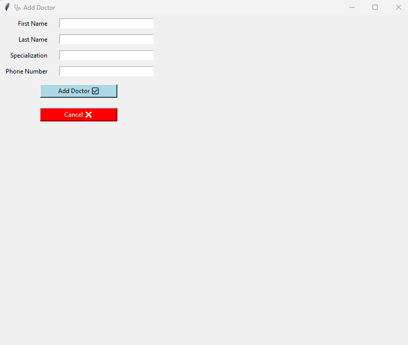
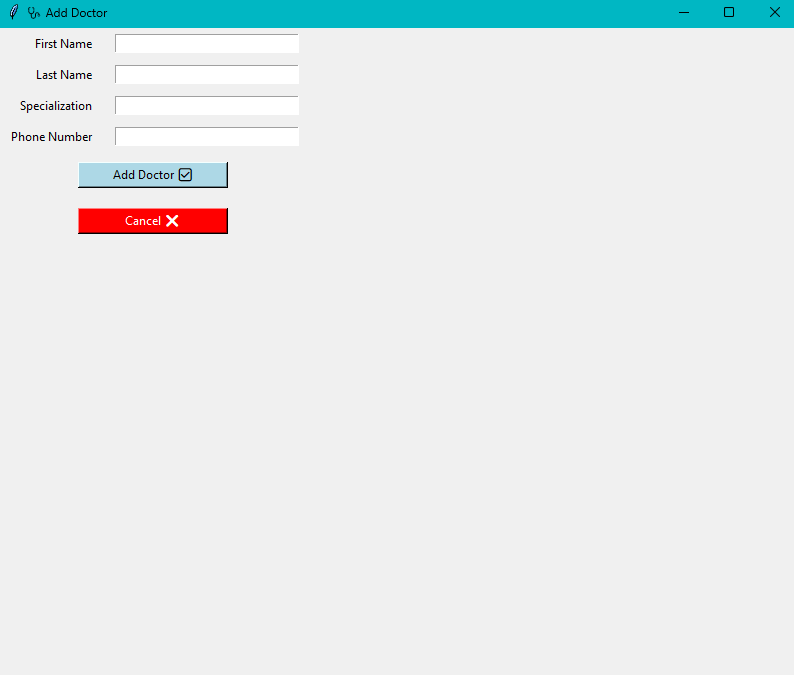
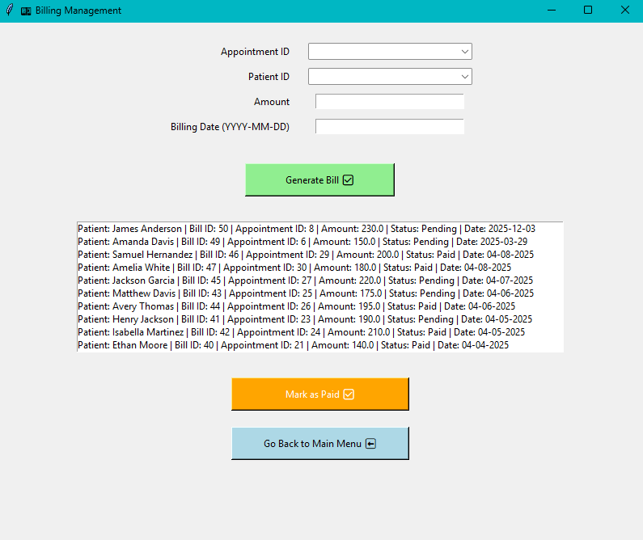
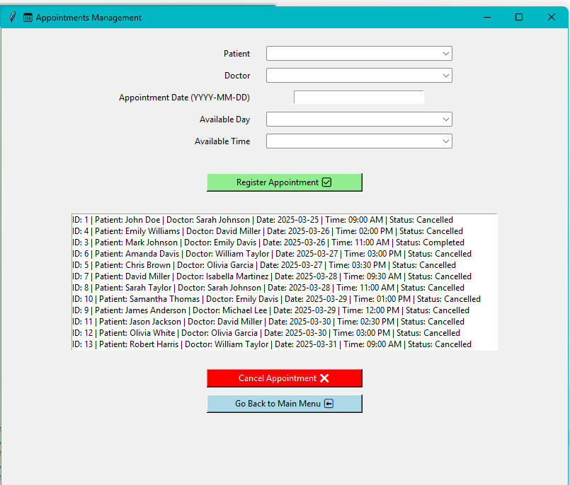

# 🏥 HPMS: Hospital Patient Management System
*A simple, efficient desktop app to manage patient records using Python, Tkinter, and SQLite.*

## 📋 Description

The **Hospital Patient Management System (HPMS)** is a lightweight, user-friendly desktop application built using Python and Tkinter. It is designed to streamline patient information management for hospitals and clinics. Hospital staff can effortlessly register, view, update, and delete patient records through an intuitive graphical interface.

## 🚀 Features Implemented

### 🧾 Patient Registration
- Collects patient details: 
  - Full Name
  - Date of Birth
  - Gender (radio buttons for Male/Female)
  - Address
  - Phone Number
  - Emergency Contact

### 📂 View Patients
- Displays all patient records in a `Treeview` table
- Includes **Edit** and **Delete** options with confirmation prompts
- `Treeview` window remains active until manually closed

### 📋 Doctor Management 🩺
- **Add** doctor records with confirmation prompts.

### 📅 Appointment Scheduling 🏥
- Schedule appointments by selecting Patient, Doctor, Date, and Time.
- **Generates** a Patient Appointment Record

### 💳 Billing 💵
- **Generate** invoices 
- **Update** bill status from Pending to Paid(after payment)

### 💽 Database Integration

The Hospital Patient Management System (HPMS) integrates with a relational database and supports basic **CRUD operations** (Create, Read, Update, Delete) for managing patient data, appointments, and billing.

### CRUD Operations

- **Create**:
  - **Patient Registration**: Allows the user to create new patient records with information like name, date of birth, and gender.
  - **Scheduling Appointments**: A new appointment is created for a patient with a selected doctor at a specified time.
  - **Billing**: Generates a new billing entry for a patient after a visit or treatment.

- **Read**:
  - **View Patient Details**: Retrieve and display a patient’s information, such as name, DOB, gender, and medical history.
  - **View Appointments**: Displays a list of all scheduled appointments for a patient.
  - **View Doctor Availability**: Check available time slots for doctors to schedule appointments.

- **Update**:
  - **Update Patient Information**: Modify patient records, such as correcting a name/address or changing a phone number.
  - **Update Appointments**: Cancel an existing appointment (updates the status from Scheduled to Cancel).
  - **Update Billing Status**: Mark invoices as "paid" or "pending" based on payment status.

- **Delete**:
  - **Delete Patient Records**: Remove a patient's record from the system, including all associated data such as appointments and billing.
---
These operations ensure that the app can handle the complete lifecycle of patient management, from registration to billing.


### 📊 Database Operations

#### 1. Tables Joined
In the Hospital Patient Management System (HPMS), the following tables are frequently joined to perform various operations:

- **Patients**: Stores details about patients (e.g., name, date of birth, gender, etc.)
- **Doctors**: Contains doctor information (e.g., name, specialization, availability)
- **Appointments**: Stores patient appointments with doctors (e.g., appointment date, patient ID, doctor ID)
- **Billing**: Stores information related to patient billing (e.g., invoice amount, payment status)
- **Doc Availabiolity**: Stores information related to doctor's available time and days

**Example Join Queries**:
- **Get patient details along with appointment and doctor information**:
  ```sql
  SELECT p.patient_id, p.name, p.dob, a.appointment_date, d.name as doctor_name
  FROM patients p
  JOIN appointments a ON p.patient_id = a.patient_id
  JOIN doctors d ON a.doctor_id = d.doctor_id;

- **Get patient billing details:**:
  ```sql
  SELECT p.patient_id, p.name, b.invoice_amount, b.payment_status
  FROM patients p
  JOIN billing b ON p.patient_id = b.patient_id;

## 🛠️ Technologies Used
- **Python 3**
- **Tkinter** – GUI library
- **SQLite** – Lightweight embedded database

## 🧪 How to Run
1. Clone this repository:
   git clone https://github.com/your-username/HPMS_app.git

2. Navigate to the project folder:
  cd HPMS_app

3. Run the  application:
python hpms_main.py

## 🧭 Future Scope
🔍 Search and Filter Functionality
Search by patient name, city, or phone number

🧍ID Generation
Implement prefixed unique IDs (e.g., P101 for patients, D205 for doctors) to enhance data clarity and scalability.

📅 Appointments Module
Setting reminders & including 30-minute interval slots to enhance scheduling flexibility and accuracy.

📖 Medical Records Tracking
Add diagnosis, prescription, and treatment history

🔐 User Authentication
Role-based login: Admin, Doctor, Receptionist

🩺 Doctor Management
Currently supports adding Name, Specialty, and Phone Number; availability details may be added in future versions.

🎨 Responsive UI Enhancements
Improved layout and error handling

🧾 PDF Report Generation
Printable PDF summaries for patient records

📢 Notifications
SMS/Email appointment reminders

📊 Analytics Dashboard
Age distribution, registration trends, and more

## 📁  Folder Structure
HPMS_app/  
├── db_connection.py        					`# Handles database connectivity logic `

├── patients.py              					`# GUI for adding and managing patient records`

├── appointments.py          					`# Module for scheduling and managing appointments` 

├── doctors.py               					`# Manages doctor details and records `

├── hpms_main.py             					`# Entry point of the Hospital Patient Management System`  

├── billing.py               					`# Generates invoices and tracks payment status `

├── doc_availability.py     					`# Tracks doctor availability in real-time `

├── test_db.py              					`# Script to test database connections and queries `

├── view_patients.py         					`# View, edit, or delete existing patient records` 

└── README.md                					`# Project overview and documentation `

└── HospitalPatientManagementSystem.db `# SQLite Database for storing patient and hospital data`

├── images/                           `# Folder containing GUI screenshots`
     
    ├── image-10.png                  `# Screenshot of Doctor Management screen`

    ├── image-4.png                   `# Screenshot of Billing screen`

    ├── image-5.png                   `# Screenshot of Patient Registration screen`

    ├── image-6.png                   `# Screenshot of Appointment Scheduling screen`

    ├── image-7.png                   `# Screenshot of Main Menu screen`

    ├── image-8.png                   `# Screenshot of View Patients screen`

    ── image-9.png                   `# Screenshot of Hospital Patient Management System overview`


## 👥 Contributor
👩‍💻 Name: Pooja Chavan

🛠️ Role: Developer & Project Maintainer

🧩 Contributions:

Designed UI with Tkinter

Implemented database functionality

Created patient registration and management modules

Wrote modular and reusable code structure

## 📌 License
This project is licensed under the MIT License.

## 📸 Screenshots 












